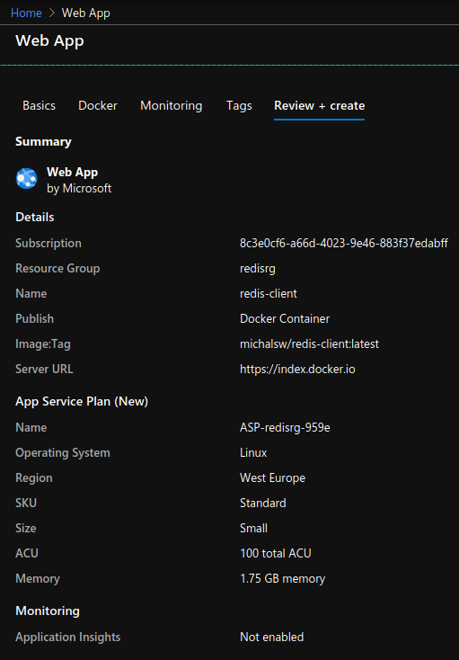
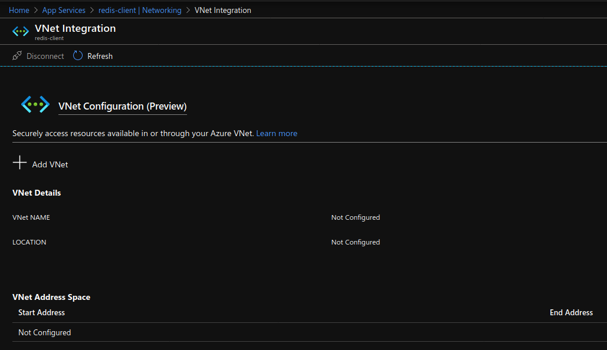
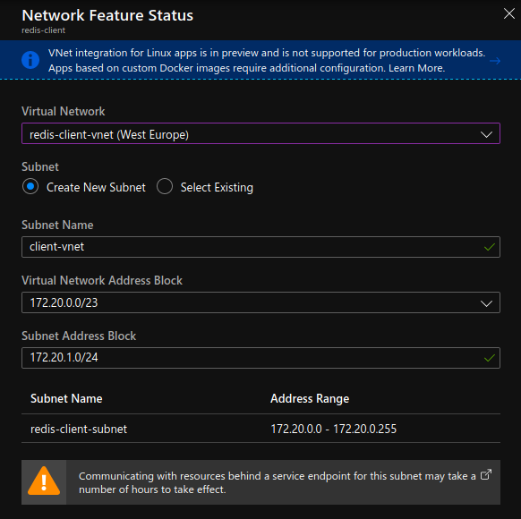
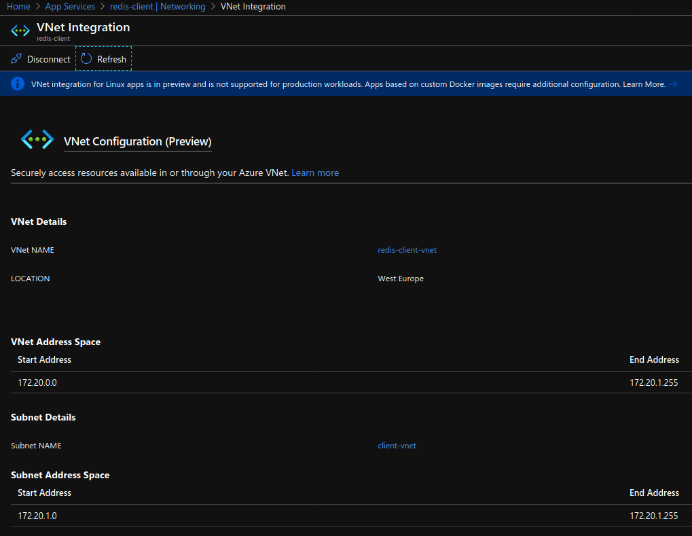

## simple redis client

Simple redis client written in Go. You can interact (set, get) either with local redis running in docker or the Azure Cache for Redis (deployed using terraform).

### # image

`michalsw/redis-client:latest`

While connecting to Redis by default there is no password set in **redis-client**. If you want to pass access key (password) use env **REDIS_PASS**. If TLS is required like in Azure use env **REDIS_TLS**.  

Use **make** to get all details and run specific command.

```
$ make help
```

### # endpoints
```
GET   /red/ping
POST  /red/setuser
GET   /red/getuser/{id}
GET   /red/home
```

### # local
```
# deploy 'redis'

$ docker run --rm -d --name redis -p 6379:6379 redis


# run 'redis-client'

$ make go-run

OR

$ REDIS_HOST=$(docker inspect -f '{{range .NetworkSettings.Networks}}{{.IPAddress}}{{end}}' redis)
$ REDIS_HOST=$REDIS_HOST make docker-run


# POST

$ curl -i -X POST -d '{"name":"mi","age":10}' localhost:8080/red/setuser
$ curl -i -X POST -d '{"name":"mo","age":20}' localhost:8080/red/setuser


# GET

$ curl -XGET localhost:8080/red/ping
PONG

$ curl -XGET -s localhost:8080/red/getuser/1 | jq
{
  "name": "mi",
  "age": 10
}

$ curl -XGET -s localhost:8080/red/getuser/2 | jq
{
  "name": "mo",
  "age": 20
}
```

### # azure

[Here](https://docs.microsoft.com/en-us/azure/azure-cache-for-redis/cache-python-get-started) you have some example how to create a Python app that uses Azure Cache for Redis.  

**Don't forget to log in to Azure!**

```
$ az login

### deploy 'redis'

ACI - Azure Container Instances

## ACI - NO access keys (password)

# > redis

$ make azure-rg

$ DNS_NAME_LABEL=redis-$RANDOM \
  LOCATION=westeurope \
  RGNAME=redisrg

$ az container create \
  --resource-group $RGNAME \
  --name redis \
  --image redis \
  --restart-policy Always \
  --ports 6379 \
  --dns-name-label $DNS_NAME_LABEL \
  --location $LOCATION \
  --environment-variables \
    DNS_NAME=$DNS_NAME_LABEL.$LOCATION.azurecontainer.io


# > test using 'redis-client' (run locally)

$ REDIS_HOST=redis-28318.westeurope.azurecontainer.io make go-run

$ curl -XGET localhost:8080/red/ping


## TERRAFORM - WITH access keys (password)

# > redis [it takes some time to deploy, even around 30 minutes..]

$ export TF_VAR_client_id=<> && export TF_VAR_client_secret=<>
$ cd redis/

$ terraform init
$ terraform plan -out out.plan

$ terraform apply out.plan
(...)
hostname = mredis.redis.cache.windows.net
primary_access_key = yIvSS+rPz3zWhG3685lj6Fw9Si51stlZgx4lYieWF0s=
ssl_port = 6380

$ terraform destroy -auto-approve


# > test using redis-client (run locally)

$ REDIS_HOST=mredis.redis.cache.windows.net \
REDIS_PORT=6380 \
REDIS_PASS=yIvSS+rPz3zWhG3685lj6Fw9Si51stlZgx4lYieWF0s= \
REDIS_TLS=true \
make go-run

$ curl -i -XGET localhost:8080/red/ping


# > test using redis-client (run using ACI)

$ make azure-rg

$ SERVICE_ADDR=80 \
REDIS_HOST=mredis.redis.cache.windows.net \
REDIS_PORT=6380 \
REDIS_PASS=yIvSS+rPz3zWhG3685lj6Fw9Si51stlZgx4lYieWF0s= \
REDIS_TLS=true \
make azure-aci

$ curl redis-client-d58df48.westeurope.azurecontainer.io/red/home

$ curl redis-client-d58df48.westeurope.azurecontainer.io/red/ping

$ make azure-aci-logs 

$ make azure-aci-delete
```

### # use case

User is connecting to Redis-client to connect to Redis-cache.  
**redis-client** is a frontend-service (deployed using App Service).  
**redis** is a backend-service (deployed using ACI in private VNet).  

```
$ az login
$ make azure-rg
```

**Deploy redis-client webapp**  


**Create the private VNet**
```
$ make azure-vnet-create
```

**Deploy redis using ACI in the private VNet**
```
$ make azure-redis-vnet
```

**Configure VNet integration**  
More details you can find [here](https://docs.microsoft.com/en-us/azure/app-service/web-sites-integrate-with-vnet).  

Select `Add VNet`:


Specify `Subnet Address Block`:  




**Configure redis-client (ENV vars)**
```
$ REDISIP=$(az container show --resource-group redisrg --name redis --query ipAddress.ip --output tsv)

$ az webapp config appsettings set --resource-group redisrg --name redis-client --settings \
  SERVICE_ADDR=80 \
  REDIS_HOST=$REDISIP \
  REDIS_PORT=6379 \
  REDIS_PASS="" \
  REDIS_TLS=""
```

**Enable logs**
```
$ az webapp log config --name redis-client --resource-group redisrg --docker-container-logging filesystem
```

**Watch logs**
```
$ az webapp log tail --name redis-client --resource-group redisrg
...
```

#### Test connection
```
$ curl -XGET https://redis-client.azurewebsites.net/red/home

$ curl -XGET https://redis-client.azurewebsites.net/red/ping
PONG

If PONG then there is connection with redis!!

$ curl -i -X POST -d '{"name":"mi","age":10}' https://redis-client.azurewebsites.net/red/setuser
$ curl -i -X POST -d '{"name":"mo","age":20}' https://redis-client.azurewebsites.net/red/setuser

$ curl -XGET -s https://redis-client.azurewebsites.net/red/getuser/1 | jq
{
  "name": "mi",
  "age": 10
}

$ curl -XGET -s https://redis-client.azurewebsites.net/red/getuser/2 | jq
{
  "name": "mo",
  "age": 20
}


# clean ALL

$ make azure-rg-del 
```
